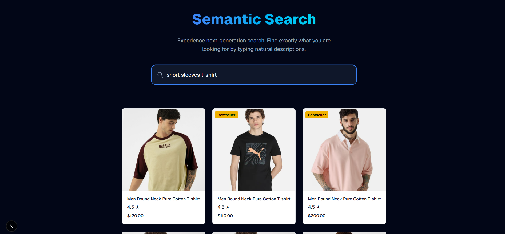
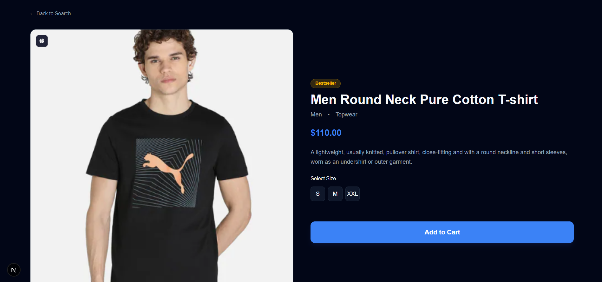

# E-Commerce Hybrid Search

A modern e-commerce application featuring **Hybrid Search** that combines semantic understanding with keyword precision. Built with Next.js, Pinecone, and Hugging Face.



## 🚀 How It Works: Hybrid Search

This application moves beyond simple text matching by implementing a **Hybrid Search** architecture. It combines two types of vectors to deliver the most relevant results:

1.  **Dense Vectors (Semantic Search)**: Generated using the `sentence-transformers/all-MiniLM-L6-v2` model. This captures the *meaning* of the query (e.g., understanding that "running gear" is related to "sneakers").
2.  **Sparse Vectors (Keyword Search)**: Generated using a BERT-based tokenizer to count token frequencies (Bag-of-Words). This ensures precise matching for specific terms, model numbers, or IDs.

### Search Pipeline
1.  **User Input**: The user types a query (e.g., "red dress").
2.  **Embedding Generation**:
    *   **Dense**: The query is sent to Hugging Face Inference API to generate a 384-dimensional dense vector.
    *   **Sparse**: The query is tokenized locally using `bert-base-uncased` to create a sparse vector representing important keywords.
3.  **Hybrid Combination**: The vectors are weighted (alpha=0.5) and combined.
4.  **Retrieval**: Pinecone's serverless index performs a dot-product similarity search using the combined vectors.
5.  **Result**: The most relevant products are returned and displayed.

## 📸 Screenshots

### Hybrid Search Results
Combining semantic context with specific attributes.


### Product Details
Detailed view of selected products.


## 🛠️ Tech Stack

- **Framework**: [Next.js 15](https://nextjs.org/) (App Router)
- **Language**: [TypeScript](https://www.typescriptlang.org/)
- **Styling**: [Tailwind CSS](https://tailwindcss.com/)
- **Vector Database**: [Pinecone](https://www.pinecone.io/) (Serverless)
- **AI/ML**:
    *   [Hugging Face Inference API](https://huggingface.co/inference-api) (Dense Embeddings)
    *   `@xenova/transformers` (Local Sparse Tokenization)

## 🔗 Application

**[Link to Live Application](https://semantic-search-eta.vercel.app/)**


## Getting Started

First, run the development server:

```bash
npm run dev
# or
yarn dev
# or
pnpm dev
# or
bun dev
```

Open [http://localhost:3000](http://localhost:3000) with your browser to see the result.

You can start editing the page by modifying `app/page.tsx`. The page auto-updates as you edit the file.

This project uses [`next/font`](https://nextjs.org/docs/app/building-your-application/optimizing/fonts) to automatically optimize and load [Geist](https://vercel.com/font), a new font family for Vercel.

## Learn More

To learn more about Next.js, take a look at the following resources:

- [Next.js Documentation](https://nextjs.org/docs) - learn about Next.js features and API.
- [Learn Next.js](https://nextjs.org/learn) - an interactive Next.js tutorial.

You can check out [the Next.js GitHub repository](https://github.com/vercel/next.js) - your feedback and contributions are welcome!

## Deploy on Vercel

The easiest way to deploy your Next.js app is to use the [Vercel Platform](https://vercel.com/new?utm_medium=default-template&filter=next.js&utm_source=create-next-app&utm_campaign=create-next-app-readme) from the creators of Next.js.

Check out our [Next.js deployment documentation](https://nextjs.org/docs/app/building-your-application/deploying) for more details.
